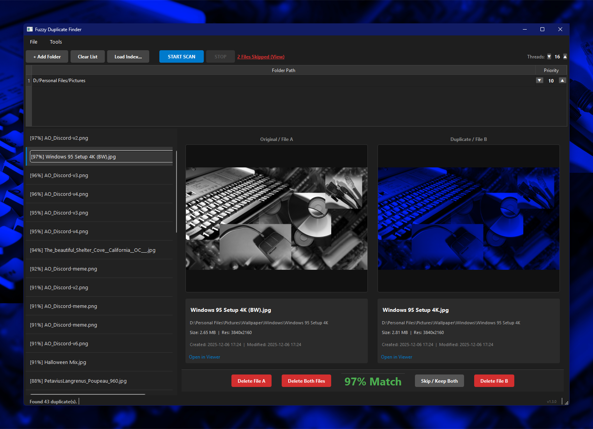
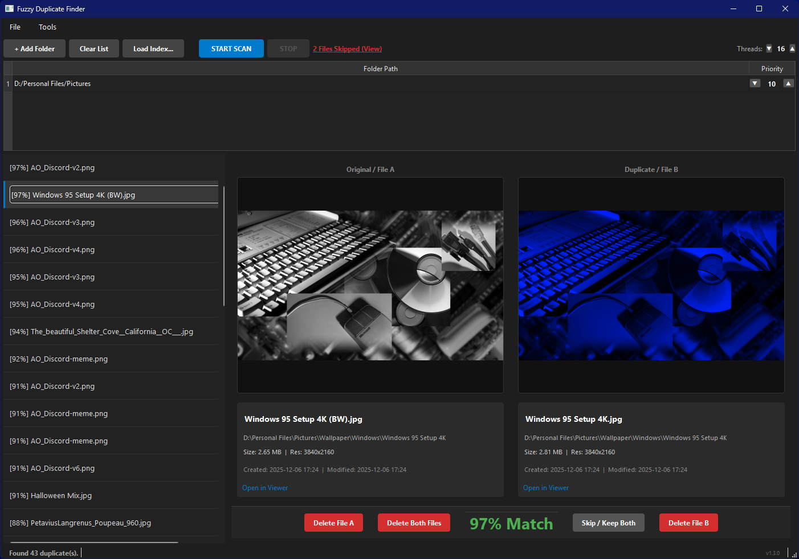
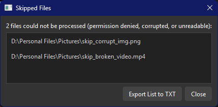

# Fuzzy Duplicate Finder

A cross-platform desktop tool for finding both exact and visually/acoustically similar duplicate files across one or more folders. Built with Python and PyQt6.



---

## Features

- **Exact duplicate detection** via MD5 hashing -- finds byte-for-byte identical files instantly
- **Fuzzy / similar file detection** using perceptual hashing for images and video, chroma fingerprinting for audio, and filename/size scoring as secondary signals
- **Percentage similarity score** shown for every match so you can judge confidence at a glance
- **Side-by-side preview** with file metadata: size, resolution, duration, created/modified dates
- **Safe deletion** -- files are always moved to the system Trash/Recycle Bin, never permanently deleted without a second prompt
- **Delete one, delete both, or skip** controls per match pair
- **Auto-prune exact duplicates** in bulk using configurable folder priority weights
- **Persistent index database** -- save and reload a scan so you don't have to re-hash everything on every run
- **Skipped files log** with one-click export to a text file, listing anything that couldn't be processed
- **Configurable thread count** -- set the number of worker threads from the UI to match your hardware
- **Multi-folder scanning** with per-folder priority settings for the auto-prune decision

---

## Supported File Types

| Category | Extensions |
|----------|-----------|
| Images | `.jpg` `.jpeg` `.png` `.bmp` `.gif` `.webp` `.tiff` `.tif` `.psd` `.raw` |
| Video | `.mp4` `.avi` `.mkv` `.mov` `.wmv` `.flv` `.m4v` `.webm` `.ts` `.mts` `.3gp` |
| Audio | `.mp3` `.wav` `.flac` `.m4a` `.aac` `.ogg` `.wma` |
| Text / Code | `.txt` `.md` `.py` `.js` `.json` `.html` `.css` `.c` `.cpp` |

---

## Installation

### Compiled binary (recommended)

Download the latest release for your OS from the [Releases page](/../../releases/latest). No dependencies required -- just run the binary.

### From source

**Requirements:** Python 3.10+

```bash
git clone https://github.com/MZGSZM/FuzzyDuplicateFinder
cd FuzzyDuplicateFinder
pip install -r requirements.txt
python main.py
```

**Dependencies installed by the above:**

- [PyQt6](https://pypi.org/project/PyQt6/) -- UI framework
- [Pillow](https://pypi.org/project/Pillow/) -- image loading and hashing
- [imagehash](https://pypi.org/project/imagehash/) -- perceptual hashing
- [opencv-python](https://pypi.org/project/opencv-python/) -- video frame extraction
- [librosa](https://pypi.org/project/librosa/) -- audio fingerprinting
- [numpy](https://pypi.org/project/numpy/) -- numerical operations
- [send2trash](https://pypi.org/project/send2trash/) -- cross-platform trash/recycle bin support

---

## Usage

### Basic workflow

1. Click **+ Add Folder** to add one or more directories to scan
2. Click **START SCAN** -- the engine indexes all supported files (Phase 1) then runs duplicate analysis (Phase 2)
3. Browse the match list on the left. Click any entry to preview both files side by side
4. Use **Delete File A**, **Delete File B**, or **Delete Both Files** to send unwanted copies to the Trash, or **Skip / Keep Both** to move on without deleting

### Loading a previous scan

Click **Load Index...** and select a `.db` file from a prior scan. The matching phase runs immediately without re-hashing files that haven't changed.

### Auto-pruning exact duplicates

Go to **Tools > Auto-Prune Exact Duplicates** to automatically remove lower-priority copies of all byte-for-byte identical files in one pass. The file to keep is determined by folder priority (see below). A confirmation dialog shows the count before anything is deleted.

### Thread count

The **Threads** spinbox in the top-right corner of the toolbar sets the maximum number of worker threads used during both the scan and the matching phases. It defaults to your system's logical CPU count. Raise it on machines with many cores and fast storage; lower it if you want to leave headroom for other work while a scan runs.

---

## Folder priorities and auto-prune logic

When scanning multiple folders, each folder is assigned a **priority** (default: 10). Use the ▲ / ▼ arrows in the folder table to adjust.

During auto-prune, for any pair of exact duplicates:

- The file in the **higher-priority folder** is kept; the other is trashed
- If both folders share the same priority, the file with the **shorter absolute path** is kept

Priorities are saved inside the index database, so they persist across sessions when you reload an index.

---

## Database and cleanup

- **Single folder scan:** the database is saved as `duplicate_index.db` inside that folder
- **Multi-folder scan:** you will be prompted to choose a save location (custom filenames are supported)
- On exit, the app offers to send the database file (and its WAL journal files) to the Trash

---

## Screenshots





*Sample photos courtesy of [International-dish78](https://www.reddit.com/user/International-dish78/) via [/r/windows](https://www.reddit.com/r/windows/comments/1kmpiox).*

---

## How similarity scoring works

Fuzzy matches are scored on a weighted combination of signals. Weights are only applied when the relevant data is available for both files.

| Signal | Weight | Method |
|--------|--------|--------|
| Perceptual hash | 50% | pHash distance (images and video thumbnails) |
| Audio fingerprint | 50% | Chroma-based MD5 via librosa (audio files) |
| Filename similarity | 20% | SequenceMatcher ratio |
| File size similarity | 10% | Proportional difference |
| Extension match | 5% | Exact string match |

Files from different media categories (image/video vs audio vs text) are never compared against each other. Pairs that are already reported as exact duplicates are excluded from the fuzzy pass.

The default similarity threshold is **70%**. Only matches at or above this score appear in the results list.

---

## License

See [LICENSE](LICENSE).
